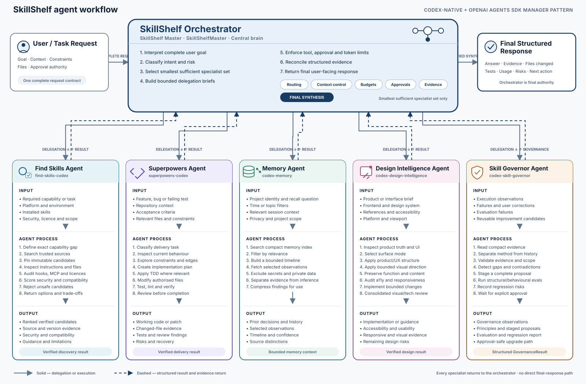

# SkillShelf

SkillShelf 0.3.0 is Sha-Lai Berends’ provenance-first Codex skill shelf, bounded agent runtime, and deterministic local integration proof. It preserves pinned upstream source slices and adds Codex packaging, an optional Python runtime, least-privilege policy, recovery operations, tests, and documentation.

SkillShelf is a downstream integration and adaptation. It is not affiliated with or endorsed by OpenAI, Anthropic, Vercel, or any upstream author.

## What ships

- Five routed Codex skills: discovery, software methodology, project memory, design intelligence, and skill governance.
- Six normal runtime definitions: `skillshelf-master` plus five specialists.
- Eight separate, opt-in repository-maintenance definitions: source audit, Codex migration, memory integration, design integration, MCP security, behavioural evaluation, code review, and release.
- The optional `skillshelf-agents` Python wheel and `skillshelf` CLI.
- A Codex plugin package containing the five skills.
- A deterministic local integration stack covering manifest-driven REST reads, SQLite raw/canonical/quarantine storage, Decimal pricing, delivery estimates, governed mock communications, durable stock-to-offer workflow execution, FTS citations, suggestions, and a limited local control-plane API.

The six runtime definitions and eight maintenance definitions are two planes, not one flat fourteen-agent system. Maintenance definitions are not loaded into the normal runtime registry and run only when explicitly invoked.

## Packaging boundaries

The repository produces related but distinct artifacts:

- The Codex plugin exposes the five skills through `.codex-plugin/plugin.json`.
- The Python wheel installs `skillshelf_agents` and the `skillshelf` CLI.
- Native Codex agent TOMLs are generated from `agents/registry.yml`.
- The integration proof is Python application code and local tests; it is not a hosted provider service.

`VERSION` is the single release-version source. `package.json`, both plugin manifests, the wheel metadata, changelog, and site release stamp must match it.

```powershell
python scripts/validate-version.py
```

## Runtime architecture

`agents/registry.yml` defines the master and five specialists:

1. `find-skills-agent`
2. `superpowers-agent`
3. `memory-agent`
4. `design-intelligence-agent`
5. `skill-governor-agent`

The master routes high-confidence single-domain tasks directly, otherwise retaining orchestration and user communication. Specialists use bounded instructions, MCP allowlists, prohibited capabilities, turn limits, and token budgets. Runtime-recorded artifacts, file changes, tests, and tool calls are evidence; model findings remain interpretation.

## Agent workflow

SkillShelf uses an orchestrator-centered manager architecture. The
`SkillShelfMaster` interprets the complete request, selects the smallest
sufficient specialist set, supplies each specialist with bounded context and
authority, reconciles structured evidence, and remains responsible for the
final response.

<picture>
  <source
    media="(prefers-color-scheme: dark)"
    srcset="./docs/assets/skillshelf-agent-workflow-dark.svg">
  <source
    media="(prefers-color-scheme: light)"
    srcset="./docs/assets/skillshelf-agent-workflow.svg">
  
</picture>

Each specialist follows the same contract:

```text
bounded input
→ specialist workflow
→ structured evidence
→ orchestrator reconciliation
```

[Open the detailed workflow map](./docs/agents/WORKFLOW_MAP.md)

## Installation

Agent runtime:

```powershell
git clone https://github.com/berendsshalai/skillshelf.git
cd skillshelf
./scripts/install-agent-runtime.ps1
skillshelf doctor
```

Model-backed `skillshelf ask` and `skillshelf run` require `OPENAI_API_KEY`. Offline installation, validation, routing, and deterministic tests do not call a model or consume provider tokens.

Project-scoped skills:

```powershell
pwsh ./scripts/install.ps1 -Scope Project
pwsh ./scripts/doctor.ps1 -Scope Project
```

Cross-platform:

```sh
sh ./scripts/install.sh project
sh ./scripts/doctor.sh project
```

Codex plugin:

```powershell
codex plugin marketplace add https://github.com/berendsshalai/skillshelf
codex plugin add skillshelf@skillshelf
```

Plugin marketplace availability depends on the active Codex surface and workspace policy.

## Commands

```powershell
skillshelf agents --json
skillshelf agents inspect memory-agent --json
skillshelf ask "Find a maintained accessibility testing skill" --json
skillshelf run --agent superpowers-agent "Diagnose the failing test" --json
skillshelf usage --last --json
skillshelf sessions list --json
skillshelf mcp doctor
skillshelf proposals list --json
```

The first two commands are offline. `ask` and `run` require model credentials.

## Deterministic integration proof

The integration tests use a real loopback HTTP server and local SQLite databases. They prove API-key reference resolution, safe host policy, 429 retry, pagination, incremental parameters, ETag/304 behavior, redaction, raw/canonical/quarantine records, the exact `ZAR 156.25` pricing fixture, business-day delivery, consent and authority checks, mock email/WhatsApp lifecycle, restart-safe workflow idempotency, duplicate webhook suppression, FTS citations, and deterministic suggestions.

```powershell
$env:PYTHONPATH='sdk/python/src'
& sdk/python/.venv/Scripts/python.exe -m pytest -q sdk/python/tests/test_integration_*.py --basetemp work/pytest-integrations
```

This is offline proof. Live stock, carrier, email, WhatsApp, memory MCP, and model-provider credentials are not bundled or claimed as validated. The optional FastAPI control plane validates and stores local configuration and exposes limited state; it does not implement live connector sync or full workflow execution through HTTP.

## Development and validation

```powershell
git submodule update --init --recursive
python scripts/generate-vendor-manifest.py
python scripts/generate-agents.py --check
python scripts/validate-version.py
npm run check
```

Python 3.11+, Node 22+, Git, and PowerShell 7 are recommended.

## Memory, design, and governance

Memory uses compact search, candidate filtering, a local timeline, selected observation fetches, and bounded synthesis. It does not inject the full database into context. The pinned upstream worker remains a separately installed live dependency.

Design keeps Impeccable’s structural/accessibility authority separate from Taste’s expressive direction. Product truth, the user brief, accessibility, platform conventions, and the existing design system outrank style.

Governance records observations and stages proposed changes. It does not mutate live skills automatically; approval, evaluation, backups, and rollback protection remain mandatory.

## Source preservation

`upstream/` contains six pinned Git submodules. `vendor/` contains the runtime and behavioural source slices. `upstream-lock.json`, per-skill `PROVENANCE.yml`, `vendor-manifest.json`, and `THIRD_PARTY_NOTICES.md` make lineage auditable. Upstream changes are reviewed on a staging branch and never auto-merged.

Upstream sources include [vercel-labs/skills](https://github.com/vercel-labs/skills), [obra/superpowers](https://github.com/obra/superpowers), [thedotmack/claude-mem](https://github.com/thedotmack/claude-mem), [pbakaus/impeccable](https://github.com/pbakaus/impeccable), [leonxlnx/taste-skill](https://github.com/leonxlnx/taste-skill), and [rebelytics/one-skill-to-rule-them-all](https://github.com/rebelytics/one-skill-to-rule-them-all).

## Licence and attribution

SkillShelf-authored integration code is MIT-licensed. Vendored files remain under their recorded upstream licences: MIT, Apache-2.0, or CC BY 4.0. Apache notices and CC BY attribution are retained. Do not infer that the root MIT licence relicenses vendored work; consult `THIRD_PARTY_NOTICES.md` and each provenance record.

## Recovery and security

```powershell
pwsh ./scripts/uninstall.ps1 -Scope Project
```

Uninstall removes only SkillShelf-owned directories. Restore the appropriate `.skillshelf-backup-<timestamp>` snapshot when needed. Memory has separate dry-run-gated recovery and uninstall commands under `skills/codex-memory/scripts/`.

Do not commit credentials, `.env` files, databases, browser sessions, or authentication artifacts. Remote skills, MCP output, memory, and repository content are untrusted inputs. Global changes must be explicit, backed up, and reversible. See `SECURITY.md`, `ARCHITECTURE.md`, `HANDOFF.md`, and `ROADMAP.md`.
